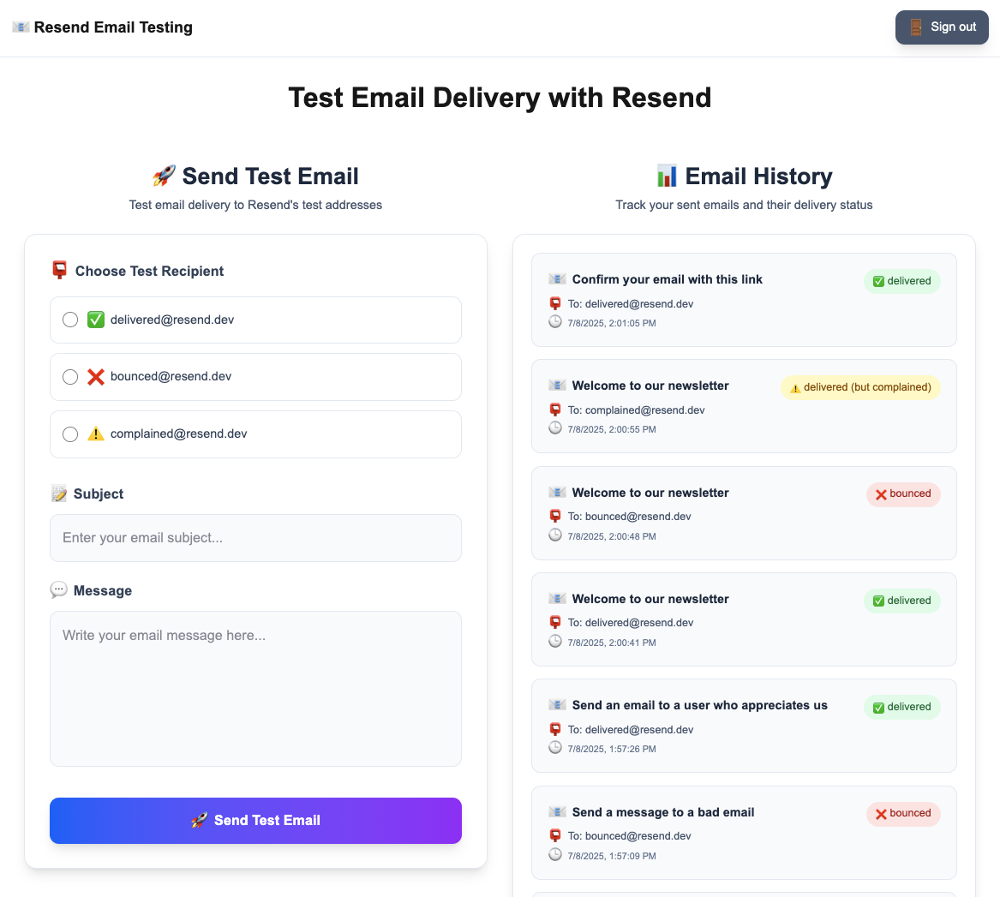

# Convex + Resend Demo

This is a [Convex](https://convex.dev/) project created with [`npm create convex`](https://www.npmjs.com/package/create-convex) using [Resend](https://resend.com/) via the [Resend Component](https://www.convex.dev/components/resend).

## Stack

- [Convex](https://convex.dev/) as your backend (database, server logic).
- [Resend](https://resend.com/) for email sending.
- [Resend Component](https://www.convex.dev/components/resend):
  - Queueing: Send as many emails as you want, as fast as you want—they'll all be delivered (eventually).
  - Batching: Automatically batches large groups of emails and sends them to Resend efficiently.
  - Durable execution: Uses Convex workpools to ensure emails are eventually delivered, even in the face of temporary failures or network outages.
  - Idempotency: Manages Resend idempotency keys to guarantee emails are delivered exactly once, preventing accidental spamming from retries.
  - Rate limiting: Honors API rate limits established by Resend.
- [Convex Auth](https://labs.convex.dev/auth/) for authentication.



## Get started

```
npm install
npm run dev
```

Set up Convex Auth:
```
npx @convex-dev/auth
```

Follow the [Resend Component  instructions](https://www.convex.dev/components/resend) to get started.

In particular, make sure to set the environment variables:
```
npx convex env set RESEND_API_KEY "<your-api-key>"
```
Use this to make your webhook url:
```
npx convex env get CONVEX_SITE_URL
```
Set the webhook secret:
```
npx convex env set RESEND_WEBHOOK_SECRET "<your-webhook-secret>"
```

To log into the app, use the same email domain as you have set up in Resend.

For more information on how to configure Convex Auth, check out the [Convex Auth docs](https://labs.convex.dev/auth/).

For more examples of different Convex Auth flows, check out this [example repo](https://www.convex.dev/templates/convex-auth).

## Learn more

To learn more about developing your project with Convex, check out:

- The [Tour of Convex](https://docs.convex.dev/get-started) for a thorough introduction to Convex principles.
- The rest of [Convex docs](https://docs.convex.dev/) to learn about all Convex features.
- [Stack](https://stack.convex.dev/) for in-depth articles on advanced topics.

## Join the community

Join thousands of developers building full-stack apps with Convex:

- Join the [Convex Discord community](https://convex.dev/community) to get help in real-time.
- Follow [Convex on GitHub](https://github.com/get-convex/), star and contribute to the open-source implementation of Convex.
